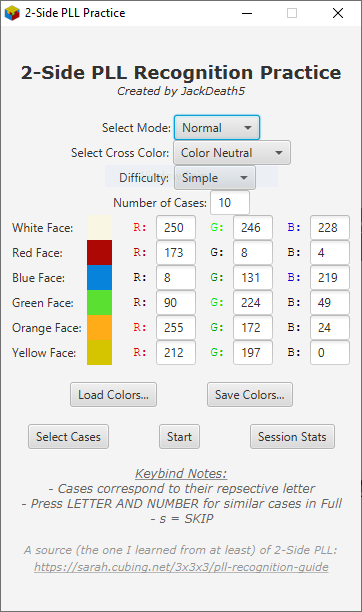
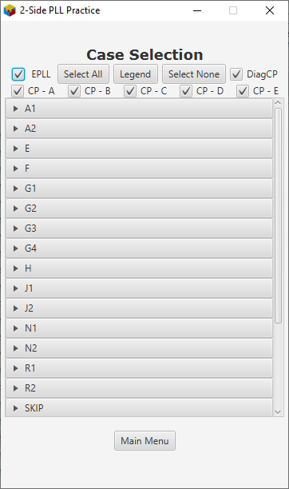

# Two Side PLL Recognition Practice Program by JackDeath5
There exists a desire to get faster at speedcubing. As a fellow speedcuber, I too want to improve at solving the cube. However, when looking for ways to improve you times, improving last layer recognition is often overlooked. Two side PLL recognition is a way to improve times a bit by knocking some time off PLLs by reducing the time it takes to recognize which case you have. Ideally, by recognizing the pattern of colors on two sides of the cube, you lose the time it takes you to look around the cube or to look at other sides of the top by using extra U moves to recognize the case.

Why doesn't everyone, especially newer speedcubers, do this? Well... learning two side PLL is kind of daunting... especially at first... kind of like full OLL in my opinion. Well, there's 22 PLL cases (including skips as cases, because it's *technically* a case, and I'd lose faith in humanity if someone couldn't recognize it) and 4 different ways each case can be looked at, meaning you would have to differentiate between 88 different color patterns. I don't know about you, but that seems like a rather large number just looking at it straight up. In addition, there's some patterns that are so similar that the color of 1 or 2 pieces could indicate completly different cases.

How would you go about learning the different setups though? Well, this is one area where there is no shortage of material online. You can easily find websites and/or Youtube videos to teach you how to distinguish between the different PLL cases. With some effort and diligence, you can learn the different patterns.

Practicing it though, is a completely different story. Sure, there's some **free** things that exist to help with practicing two side PLL recognition, but nothing I found was...satisfactory...in my opinion (no disrespect to those **free** things though).So, I figured that since know how to code Java, and having learned how to use a bit of JavaFX in high school, that I would make my own program and share it to the cubing community in a way that everyone can use it. I also deciced to make it open source, so that anyone could work on the code if they wanted to. My goal with this project of mine is to provide this free for anyone to use, so that good practice is accessible and not locked behind a paywall.

### Sidenote
To those who actually know how to code and have a lot of experience with it, I just want you to know that I coded the bulk of this before starting college, and so I didn't javadoc everything like I should have. Coming back to this to add a few more things after a year in college, I'm now regretting it. I'm sorry, but I learned to code by throwing in a bunch of comments to describe things going on in the code instead of Javadocing everything. I'll try to add the Javadoc as time goes on, I just decided to post this to get it out to people because my schedule is about to get a bit more busy. So, I apologize to anybody attempting to do this early on after the initial posting about the mountain of comments and code they'll need to go through to understand what's going on.

## How to Use

So this is the main menu. This is what you open up to when you run the application. You can select what you want to do from here. You can select the mode, choose you cross color, choose the difficulty, set how many cases you want to be tested on, and what colors you want your cube to be.

### Mode
The mode could either be **normal** or **debug**.
- The **normal** mode is the mode you will probably be on most of, if not all of the time. In this mode, random PLLs based those selected in the *Select Cases* menu. The cube colors abide by the cross color chosen. The cube colors will match those set on the menu.
- The **debug** mode is essentially the testing setup without the testing. It outputs stuff into the console about what's going on. It has a menu bar at the top where you can decide what actions to do. You can also change the colors of the cube and see how they look on the cube after you change them, if that will help you pick colors better. You can also experiment and see how it looks on different permutations by clicking the menu option that generates a PLL. A new case will randomize the PLL and the colors of the cube while still abiding by the selected cross from the menu.
### Cross Color
With this setting, you can choose your cross color. You can set your cross color to ANY of the 6 colors on the cube. You can even set it to be color neutral (actually that's what it defaults to because I'm color neutral, but that's besides the point). By setting the cross color, the cube and PLL cases are shown to you in a way such that its colors will line up like the cross color is on the bottom. Meaning, that if you set the cross color to white, you will always have yellow on top.
### Difficulty
Difficulty, (the best term I could use for it), could either be **simple** or **full**. The difficulty basically changes what PLLs you could guess. I think it's best to use an example to describe this:
Say your given a case that you recognize to be an R-perm. For **simple**, you only need to answer **R** because you know it's an R-perm. For **full**, you would need to differentiate between an **R1/Ra** and **R2/Rb** and answer with one of those instead. Stats are tracked individually for each difficulty, and you can easily check them both in the *Session Stats* menu. More on this later.
### Number of Cases
This number is the number of cases you can set for a single quiz session. Right now, I have it set to be a number between 1-999, because I don't know why you would need to do more than 999 at a time, because it seems like it would be a nightmare going through results. Also, don't have a pause function implemented, because I feel like it would be weird starting back in. So, choose your case numbers wisely. Furthermore, stats are saved cumulatively in *Session Stats* so I don't see there being much of a point.
### Cube Colors
Cube colors are RGB values, and can be switched individually by changing their indiviudal RGB values. Changing the values here will not only be changed when testing, but will also be changed for the cubes when look in the *Select Cases* menu and when you go into debug. You can load colors from a file and save them to a file. **If you want to update the cube colors for a saved session file (more on this later), replace the file. It will change the cube colors in that file, and keep all of the session data intact.**

### Case Selection
 
This menu is the one you are brought to when click *Select Cases* on the main menu. In this menu, you can select which cases you want to be tested on. Each item seen inside the scrolling area is a dropdown that shows the 4 different ways each PLL case can be setup. You can uncheck the boxes for the cases you do **not** want to see in the tests. These cases will stay the same for both difficulties. In addition, there is also presets that can be set. I set the presets based on the categories made in [Sarah's Cubing Site](https://sarah.cubing.net/3x3x3/pll-recognition-guide). I am not affiliated with that website- it's just the place I learend my two side pll recognition. And I think it's a good way of organizing them. So, I used those groups for presets. Credit goes to that website for the grouping though. The preset checkboxes work like this: checking them off will turn all the cases for that specific preset off while checking it on will turn on all the cases for that specific preset. Cases can be modified manually outside of setting them. You can also select all and select none to be highlighted at once. The colors of the cubes are consistent throughout all of the cases. The colors match thosein the main menu, and the cubes abide by the cross color set in the main menu as well.

### Session Statistics
This menu is the one you are brought to when click *Session Stats* on the main menu. In this menu, you can select which cases you want to be tested on. This is where the statistics for the test sessions are stored. It tracks stats for each different orientation of each different PLL case. Each case has 4 different orientations. You can refer to *Case Selection* for matching specific cases/orientations with certain block setups. This menu stores stats of the full and simple difficulties individually of each other. That means that testing in full difficulty will **not** affect your simple difficulty stats. You can switch between them with a button near the top left of the scroll window. Sessions stats records a variety things **for each case/orientation** which I thought may be helpful for people trying to improve including: total test questions, how many correct/incorrect guesses, accuracy, fastest (correct) guess time, slowest (correct) guess time, average (correct) guess time, standard deviation of (correct) guess times, and most wrong guess (which case do you guess the most when you get it wrong). You can switch between viewing the number of correct guesses and the number of incorrect guesses by clicking the button near the top right of the scroll window. Because what you're viewing is a table, you can also sort between highest/lowest for each thing by clicking the specific label at the top. You can also resize the columns to your own desire. The last 2 things of note on the screen are the *Import...* and *Export...* buttons. Yes, you **can** save your session to a file. It will save **both** your full and simple stats as well as your custom cube colors set on the main menu. It saves the file as a text file with the a specific formatting in the file. If you want to mess with the files, you do you. There is *some* error checking, but it will not crash the program if you give it a file with invalid data and instead give a pop-up window with the error. The colors go first, followed by the simple difficulty entries and then the full difficulty entries. Speaking of colors, if you wish to change the colors on a save file, you can do that in the main menu. When doing so, **REPLACE** the file with session stats that you wish to change. It will only change the colors in the file and keep all of the other data in it. The main goal of my file saving/loading was so that someone could save their session and come back to it later on and continue.

### Testing
This is where the testing happens. Testing will give you different PLL cases with random cube color orientations abiding by A) the cross color set on the main menu and B) the color orientations would match that of an actual rubiks cube so it looks legit. In addition, it will only test you on cases that are checked in the *Case Selection*U. Upon clicking *Start* in the main menu, you will be brought to the testing window. A timer will count down to 0, which is when the first case will appear. The case, as seen in the pictures is presented in the window. Below it, you will see the timer. And below and to the right of the case, you will see a number representing the question number. Buttons will appear on the bottom matching the selected difficulty in the main menu. The button layouts will appear as seen in the images. *"But clicking the buttons is SLOOOOWWWWW- is there some other way I can do it to better show my speed?"* Actually, yes there is. I have implemented keybinds that you could use instead for guessing. However, they work *slightly* differently between the simple and full. Generally, I have set the keybinds to match those the name of the PLLs. So for instance, let's say you're given a pattern you recognize to be an A2. In **simple**, you would only need to press the *A* key to guess. In **full**, you would need to press the *A* key **AND** the *2* key **AT THE SAME TIME** to make the correct guess. This goes for all similar cases in **full**, such as J1/J2, R1/R2, etc. For the different G perms in **full**, Ga = *G* key + *1* key, Gb = *G* key + *2* key, Gc = *G* key + *3* key, Gd = *G* key + *4* key. However, for PLLs like T and Z, you only need to press those that specific key in either difficulty. So you do **NOT** need to press the *Z* key and the *1* key to guess a Z perm in **full** difficulty. Just wanted to make that clear.

**I feel that I have to justify my choices for the PLL names, so I'll do it here. What I'm referring to, is the fact that I referrence PLLs that have multiple cases such as the J perms, R perms, etc as J1/J2 and R1/R2 instead of Ja/Jb and Ra/Rb. I'm sorry to those who may get put off by this decision, but I have a few reasons for doing so. First of all, that's just how I learned them. I may be weird, but it's just how I learned. Secondly, it makes keybinds for the full difficulty simpler. Sure, holding a the perm letter and the *a* or *b* key may be the fine, but what about Aa and Ab? Hmm? Makes assigning those a bit weird and would ruin the overall consistent nature of the keybind patterns I've intended. Thirdly, it really isn't that much different. All [PERM LETTER]1s and [PERM LETTER]2s correspond to all [PERM LETTER]as and [PERM LETTER]bs. It's not like the kind of switch an experienced cuber would percieve for switching from crossing on white to color neutral. Nah. So, I hope this doesn't put anyone off. Just felt like I needed to mention why I did what I did.**

